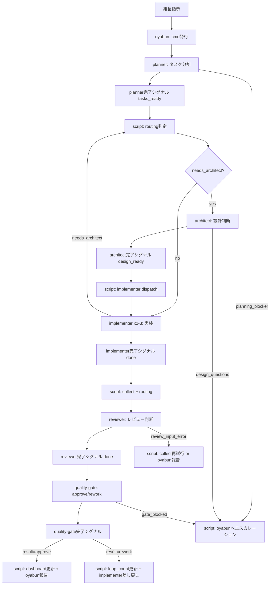
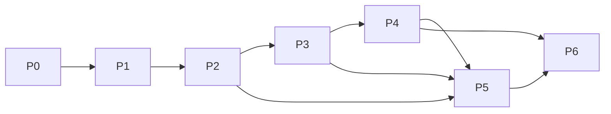

# yamibaito v2 設計書: 「1エージェント1判断」アーキテクチャ

- 作成日: 2026-03-21
- 対象: `dark-part-time-job`
- 目的: v1の集中制御を廃止し、**判断を単機能エージェントへ分散**、ルーティング/collect/更新はスクリプトへ移管する。
- 最重要原則: **1エージェント = 1判断**

## セクション1: アーキテクチャ全体図

### 1.1 エージェント構成と責務境界

| 区分 | コンポーネント | 判断内容 | 判断数 | やらないこと |
|---|---|---|---:|---|
| Agent | oyabun | 何をやるか（cmd発行） | 1 | 分割、実装、レビュー、遷移 |
| Agent | planner | タスク分割（並列実行単位化） | 1 | 技術方針決定、品質判定 |
| Agent | architect | 設計判断（技術方針・依存関係） | 1 | 分割、レビュー判定 |
| Agent | implementer (x2-3) | 判断なし（実装のみ） | 0 | 仕様変更判断、品質判定 |
| Agent | reviewer | レビュー判断（findings / 修正指示） | 1 | 最終承認 |
| Agent | quality-gate | 品質判定（approve / rework） | 1 | 実装、分割、設計 |
| Script | orchestrator + CLI scripts | 判断なし（機械的遷移） | 0 | 主観判定 |

**構造変更の要点**
- v1若頭ロールは廃止し、`planner` に置換する。
- 「分割」「設計」「レビュー」「品質判定」を別エージェントへ固定し、1ロール複数判断を禁止する。
- 実装者は判断権を持たず、契約に沿った変更のみ実施する。

### 1.2 全体フロー



### 1.3 プロンプト設計方針（各 1,000-2,000 tokens）

| ロール | 目標token | 構成 | 圧縮方針 |
|---|---:|---|---|
| `prompts/v2/oyabun.md` | 1.0k-1.5k | 任務定義、cmd YAML契約、禁止事項 | v1 `oyabun.md` から運用説明を削除 |
| `prompts/v2/planner.md` | 1.2k-2.0k | 分割規則、依存分解、task出力契約 | v1集中制御プロンプトの機械処理章を除外 |
| `prompts/v2/architect.md` | 1.2k-2.0k | 技術方針、dependency_contract、制約解釈 | 方針判断のみ残す |
| `prompts/v2/implementer.md` | 1.0k-1.6k | 入力契約、編集ルール、完了シグナル | 判断文脈を排除 |
| `prompts/v2/reviewer.md` | 1.2k-2.0k | finding規約、証拠、修正指示 | 承認判断は持たせない |
| `prompts/v2/quality-gate.md` | 1.0k-1.8k | approve/rework判定規則、再作業テンプレ | 実装修正指示の詳細生成はしない |

補足:
- v1集中制御プロンプトは 8,686 tokens で多責務だったため、v2は役割分離で自然圧縮する。
- context-compaction/recovery は各ロールの Hook 節で局所化する。

### 1.4 スクリプトが担う機械処理一覧

| 処理 | 実装先 | 備考 |
|---|---|---|
| pane監視 | `scripts/yb_orchestrator.py` (新規) | 5秒ポーリング、末尾ログ監視 |
| JSON抽出/正規化 | `yb_orchestrator.py` | `role/status/result` 契約をロール別に検証 |
| 遷移判定 | `yb_orchestrator.py` | ルールベース、主観判断なし |
| dispatch | `scripts/yb_dispatch.sh` 拡張 | 非対話一括dispatch (`P-02`) |
| collect | `scripts/yb_collect.sh` 拡張 | resetガード (`R-02`) 維持 |
| dashboard更新 | `yb_orchestrator.py` + collect | event-log由来で更新 |
| readiness check | `scripts/yb_start.sh` 拡張 | 固定sleep依存を排除 (`R-01`) |
| ログ永続化 | `.yamibaito/runtime/*.jsonl` | 相関ID付き構造化ログ (`P-05/R-05`) |

### 1.5 JSON完了シグナル仕様

原則:
- エージェントは「自分の判断結果」だけを返す。
- `next.*` / `差し戻し先` / `次遷移先` はエージェント出力に含めない。
- 次ホップは `yb_orchestrator.py` が `role + status + taskState`（`quality-gate` は `result` も参照）から機械的に決定する。

planner 完了シグナル:
```json
{
  "mission": "completed",
  "ts_ms": "1710876446123",
  "task_id": "cmd_0038_task_001",
  "pane_id": "0.1",
  "role": "planner",
  "status": "tasks_ready",
  "task_count": 3
}
```

architect 完了シグナル:
```json
{
  "mission": "completed",
  "ts_ms": "1710876449456",
  "task_id": "cmd_0038_task_001",
  "pane_id": "1.0",
  "role": "architect",
  "status": "design_ready"
}
```

implementer 完了シグナル:
```json
{
  "mission": "completed",
  "ts_ms": "1710876452123",
  "task_id": "cmd_0038_task_001",
  "pane_id": "0.2",
  "worker_id": "worker_001",
  "role": "implementer",
  "status": "done"
}
```

reviewer 完了シグナル:

```json
{
  "mission": "completed",
  "ts_ms": "1710876458456",
  "task_id": "cmd_0038_task_001",
  "pane_id": "1.1",
  "role": "reviewer",
  "findings": [],
  "recommendation": "approve",
  "status": "done"
}
```

quality-gate 完了シグナル:

```json
{
  "mission": "completed",
  "ts_ms": "1710876464789",
  "task_id": "cmd_0038_task_001",
  "pane_id": "1.2",
  "role": "quality-gate",
  "result": "approve",
  "reason": "checklist を満たし重大指摘がない"
}
```

検証ルール:
- `mission in {"completed","error"}` を必須マーカーにする。
- `ts_ms` は文字列整数（epoch ms）を正とする。移行互換として `ts`（epoch sec）も受理し、`ts_ms = ts * 1000` へ正規化する（`ts_ms` と `ts` が併存する場合は `ts_ms` を優先）。
- `task_id/role` 欠落は無効シグナル。`pane_id` 欠落時は受信元paneから補完してから検証する。
- `taskPaneKey = task_id + ":" + pane_id` とし、`ts_ms <= lastTimestampByTaskPane[taskPaneKey]` は破棄する。
- `role=planner` は `status == "tasks_ready"` + `task_count >= 1` を必須とする。
- `role=architect` は `status == "design_ready"` を必須とする。
- `role=implementer` は `status == "done"` + `pane_id`（または `worker_id`）を必須とする。
- `role=reviewer` は `status == "done"` + `findings` + `recommendation in {approve,rework}` を必須とする。
- `role=quality-gate` は `result in {approve,rework}` + `reason` を必須とする。
- `mission == "error"` の場合は `status in {planning_blocker,design_questions,needs_architect,review_input_error,gate_blocked}` + `reason` を必須とする。
- 重複排除は orchestrator 側で `sig_hash = sha256(task_id + pane_id + role + ts_ms + raw_json)` を計算して実施する。

### 1.6 状態管理（orchestrator-state）

保存先: `.yamibaito/runtime/orchestrator-state.json`

```json
{
  "schema_version": 1,
  "mode": "hybrid",
  "poll_interval_sec": 5,
  "lastTimestampByTaskPane": {
    "cmd_0038_task_001:0.2": 1710876452123,
    "cmd_0038_task_001:0.3": 1710876452451,
    "cmd_0038_task_001:1.1": 1710876458456
  },
  "processedSignals": [],
  "taskState": {
    "cmd_0038_task_001": {
      "phase": "review",
      "loop_count": 0,
      "assigned_worker": "worker_001",
      "updated_at": "2026-03-21T02:00:00+0900"
    }
  },
  "locks": {
    "dispatch": false,
    "collect": false
  },
  "version": "v2-alpha"
}
```

運用ルール:
- `processedSignals` は固定長（例: 2,000件）で循環保持。
- `lastTimestampByTaskPane` は `taskPaneKey = task_id + ":" + pane_id` で管理し、role単位では管理しない。
- `taskState` が唯一の遷移真実源。dashboard は投影結果として扱う。
- 状態更新は一時ファイル経由で atomic rename する。

---

## セクション2: 各エージェントの詳細設計

以下は全ロール共通で **「入力契約 -> 判断1つ -> 出力契約」** を強制する。

### 2.1 oyabun

| 項目 | 設計 |
|---|---|
| 入力契約 | 組長指示、制約、目的、優先度 |
| 出力契約 | `cmd YAML`（`cmd_id`, `title`, `description`, `constraints`, `quality_gate`） |
| 起動条件 | 新規要求を受領したとき |
| 終了条件 | `director_to_planner.yaml` に投入可能な cmd を1件出力 |
| エラー時 | 情報不足なら `missing_inputs` を返して停止（推測分割しない） |

`prompts/v2/oyabun.md` 骨格:
1. Role/Goal
2. Inputs/Constraints
3. YAML schema
4. Do/Don't
5. Completion format

### 2.2 planner

| 項目 | 設計 |
|---|---|
| 入力契約 | `cmd YAML` |
| 出力契約 | `tasks.yaml`（task単位の `status: assigned`, `depends_on`, `needs_architect`） |
| 起動条件 | `cmd` 受付直後 |
| 終了条件 | 並列投入可能なタスク群を定義し、依存が明示されている |
| エラー時 | 分割不能なら `planning_blocker` を返し、oyabunに再質問 |

`prompts/v2/planner.md` 骨格:
1. Task decomposition rules
2. Parallelization policy
3. Dependency declaration rules
4. Output template (`templates/plan/tasks.yaml` 準拠)
5. Stop conditions

### 2.3 architect

| 項目 | 設計 |
|---|---|
| 入力契約 | task要件、既存コード文脈、依存候補 |
| 出力契約 | 設計方針（`dependency_contract`, 非機能要件, 実装禁止事項） |
| 起動条件 | `needs_architect: true`（planner判定またはimplementerの `status=needs_architect`） |
| 終了条件 | implementerが判断なしで実装可能な方針を返す |
| エラー時 | 仕様欠落時は `design_questions` を返して停止 |

`prompts/v2/architect.md` 骨格:
1. Architecture decision scope
2. Interface/dependency contract checks
3. Tradeoff table
4. Output schema
5. Reject conditions

### 2.4 implementer

| 項目 | 設計 |
|---|---|
| 入力契約 | task YAML + 設計方針 + 制約 |
| 出力契約 | 成果物変更 + `{"mission":"completed","ts_ms":"...","task_id":"...","pane_id":"...","worker_id":"...","role":"implementer","status":"done"}` |
| 起動条件 | `status: assigned` かつ依存充足 |
| 終了条件 | 実装完了または blocker を構造化報告 |
| エラー時 | 判断要求が発生したら実装を止め、`needs_architect: true` を返す |

`prompts/v2/implementer.md` 骨格:
1. Read-only decision policy (判断禁止)
2. File constraints handling
3. Edit/verification protocol
4. Completion JSON schema
5. Blocker response format

### 2.5 reviewer

| 項目 | 設計 |
|---|---|
| 入力契約 | 実装差分、task要件、review-checklist |
| 出力契約 | `{"mission":"completed","ts_ms":"...","task_id":"...","pane_id":"...","role":"reviewer","findings":[...],"recommendation":"rework|approve","status":"done"}` |
| 起動条件 | implementer完了シグナル受信 |
| 終了条件 | findings と recommendation を一意に返却（遷移先は返さない） |
| エラー時 | 差分不足時は `review_input_error` を返し collect 再実行要求 |

`prompts/v2/reviewer.md` 骨格:
1. Evidence-first review rules
2. Severity taxonomy
3. Checklist mapping (`templates/review-checklist.yaml`)
4. Rework instruction template
5. Exit format

### 2.6 quality-gate

| 項目 | 設計 |
|---|---|
| 入力契約 | review結果 + 成果物メタ + loop_count |
| 出力契約 | `{"mission":"completed","ts_ms":"...","task_id":"...","pane_id":"...","role":"quality-gate","result":"approve|rework","reason":"..."}` |
| 起動条件 | reviewer結果受信 |
| 終了条件 | 判定（`approve/rework`）と理由のみ返却（差し戻し先は返さない） |
| エラー時 | 判定不能時は `gate_blocked` を返し oyabunへエスカレーション |

`prompts/v2/quality-gate.md` 骨格:
1. Gate policy
2. Loop control (`max_loop_count`)
3. Approve/rework criteria
4. Rework reason contract (R-04/P-03)
5. Final JSON format

### 2.7 競合防止とエラー共通規約

- 同一ラウンドで「実装担当者 == reviewer」を禁止（`R-03/P-04`）。
- `max_loop_count` 超過時は自動 `oyabun` エスカレーション。
- 全ロールは終了時に機械可読 JSON を1件だけ出力（重複終了を防止）。

---

## セクション3: スクリプト・オーケストレーターの設計

### 3.1 `scripts/yb_orchestrator.py`（新規）責務

`yb_orchestrator.py` は「判断しない制御プレーン」として実装する。

責務:
- pane監視（planner/architect/implementer/reviewer/quality-gate）
- JSON完了シグナル抽出
- 遷移ルール適用
- `yb_dispatch.sh` / `yb_collect.sh` 呼び出し
- `orchestrator-state` 永続化
- dashboard投影

非責務:
- 技術妥当性判断
- レビュー内容生成
- 優先度裁定

### 3.2 監視から遷移までのフロー

1. `tmux capture-pane` で対象ペイン末尾5-20行を取得。
2. `extract_last_json_object()` で最新JSON候補を抽出。
3. `mission in {completed,error}` と `role` 別の必須キー（`status` / `task_count` / `recommendation` / `result`）を検証し、`ts_ms`（互換として `ts` 受理）を正規化する。
4. `taskPaneKey = task_id + ":" + pane_id` 単位の `timestamp guard` と `sig_hash` で重複除外。
5. `taskState` を更新し、`role + status + taskState`（`quality-gate` は `result`）で次アクションを決定。
6. `yb_dispatch.sh` / `yb_collect.sh` を非対話で起動。
7. `dashboard.md` と runtime logs を更新。

機械的遷移ルール（正常系）:

| 受信ロール | 受信条件 | orchestrator の次アクション |
|---|---|---|
| planner | `status == tasks_ready` | `tasks.yaml` を読み、`needs_architect=true` を含む task があれば architect dispatch、なければ implementer dispatch |
| architect | `status == design_ready` | 対象 task の設計依存を充足済みに更新し、implementer dispatch |
| implementer | `status == done` | reviewer を起動 |
| reviewer | `status == done` | quality-gate を起動 |
| quality-gate | `result == approve` | dashboard更新 + oyabun報告 |
| quality-gate | `result == rework` | `loop_count` を加算し、`taskState.assigned_worker` の implementer に差し戻し（`max_loop_count` 超過時は oyabunへエスカレーション） |

機械的遷移ルール（error系）:

| 受信ロール | 受信条件 | orchestrator の次アクション |
|---|---|---|
| planner | `status == planning_blocker` | oyabun へ再質問依頼をエスカレーションし、task を `blocked_planning` で停止 |
| architect | `status == design_questions` | oyabun へ設計質問をエスカレーションし、回答待ちで停止 |
| implementer | `status == needs_architect` | 対象 task に `needs_architect=true` を付与して architect dispatch |
| reviewer | `status == review_input_error` | collect を1回だけ再実行して reviewer を再dispatch。再発時は oyabunへエスカレーション |
| quality-gate | `status == gate_blocked` | gate判定を停止し、oyabunへ即時エスカレーション |

### 3.3 `tmux-orchestrator.js` からの適応ポイント

| tmux-agents-starter パターン | v2への適応 |
|---|---|
| 5秒ポーリング | 既定5秒、`config.yaml` で変更可能 |
| 末尾JSON抽出 | Python実装で同等関数を実装 |
| `lastTimestamp` ガード | `task_id:pane_id` 単位 `lastTimestampByTaskPane` へ拡張 |
| `/clear -> sleep -> send` | `yb_dispatch.sh` 側共通関数へ吸収 |
| `AGENT_CLI_MAP` | 既存 `scripts/lib/agent_config.py` で役割別CLI解決 |

### 3.4 状態ファイル構造と永続化

ファイル:
- `.yamibaito/runtime/orchestrator-state.json`
- `.yamibaito/runtime/orchestrator-events.jsonl`
- `.yamibaito/runtime/orchestrator-locks/`

永続化ルール:
- state更新は `state.tmp -> fsync -> rename`。
- JSONLは append-only。
- 異常終了時は次回起動で `taskState` と queue の整合チェックを実施。

### 3.5 二重遷移防止・タイムスタンプガード

防止策は3層で実装:

1. `taskPaneKey = task_id + ":" + pane_id` ごとに `ts_ms <= lastTimestampByTaskPane[taskPaneKey]` を破棄。
2. `sig_hash` 重複を破棄。
3. `taskState.phase` と `role/status/result` 不整合を破棄（例: 未reviewタスクの `quality-gate` シグナルは無効）。

追加ガード:
- dispatch直前に taskファイルを再読込し、`status` が未更新なら中断。
- collect実行中は `dispatch` ロックを取り、競合更新を禁止。

### 3.6 legacy/hybrid/v2 モード切替

| モード | 目的 | 挙動 |
|---|---|---|
| `legacy` | v1互換 | orchestrator停止。手動 `yb_dispatch`/`yb_collect` |
| `hybrid` | 移行期 | `routing_policy: v2` の task のみ orchestrator 駆動。その他は手動運用（同一task内の経路混在は禁止） |
| `v2` | 本番 | 全task遷移を orchestrator 駆動（legacy経路は使わない） |

切替ルール:
- `yb start` は `config.yaml: orchestrator.mode` を参照。
- `hybrid` は段階移行期間のみ利用し、v2本番後は `legacy` と完全分離する。

---

## セクション4: yb CLI との統合設計

### 4.1 既存コマンドへの影響と拡張点

| コマンド | 互換性 | v2拡張 |
|---|---|---|
| `yb start` | 既存維持 | v2 pane生成、orchestrator pane起動、readiness check |
| `yb_dispatch.sh` | 既存維持 | role指定dispatch、二段send-keys、一括dispatch |
| `yb_run_worker.sh` | 既存維持 | 完了時JSONシグナル標準出力 |
| `yb_collect.sh` | 既存維持 | JSONシグナル連動collect、reset guard強化 |
| `yb_stop.sh` / `yb_restart.sh` | 既存維持 | orchestratorプロセスの停止/再開を追加 |

互換原則:
- 既存フラグを破壊しない。
- v2未設定時は legacy挙動。
- 破壊的変更は新規フラグでのみ有効化。

### 4.2 `yb start` での v2 セッション起動

起動シーケンス:

1. `config.yaml` 読み込み（mode, worker数, role CLI）。
2. tmuxセッション作成。
3. v2 pane配置。
4. pane map を `.yamibaito/panes*.json` へ保存。
5. orchestrator pane で `python3 scripts/yb_orchestrator.py --mode ...` を起動。
6. readiness check 成功後、plannerへ初回プロンプト投入。

### 4.3 paneレイアウト（v2）

最小8ペイン:
- `oyabun`
- `planner`
- `architect`
- `implementer-1`
- `implementer-2`
- `implementer-3`（任意: 2人運用時は待機）
- `reviewer`
- `quality-gate`
- `orchestrator`

推奨配置:

```text
Window 0: oyabun | planner
Window 1: architect | reviewer | quality-gate
Window 2: implementer-1 | implementer-2 | implementer-3 | orchestrator
```

### 4.4 `config.yaml` の v2 拡張

追加案:

```yaml
orchestrator:
  enabled: true
  mode: hybrid          # legacy | hybrid | v2
  poll_interval_sec: 5
  max_signal_history: 2000
  timestamp_guard: true

v2_roles:
  planner:
    pane: "0.1"
    cli: claude
  architect:
    pane: "1.0"
    cli: codex
  reviewer:
    pane: "1.1"
    cli: codex
  quality_gate:
    pane: "1.2"
    cli: claude
  implementer:
    panes: ["2.0", "2.1", "2.2"]
    cli: codex

contracts:
  completion_signal_version: 1
  require_status_assigned_on_task_create: true
```

設計意図:
- v2 の役割解決は `v2_roles.*` のみを参照する（v1若頭経路は持たない）。
- v1互換運用は `mode=legacy` に分離し、v2設計内部へ混在させない。

---

## セクション5: 実装フェーズ（おすすめ順）

各フェーズは独立デプロイ可能、かつロールバック可能に設計する。

### 5.1 フェーズ一覧

| Phase | 目的 | 主成果物 | 完了条件 | ロールバック |
|---|---|---|---|---|
| 0 | 安全弁先行 | `status:assigned` 自動付与、readiness/reset/review競合ガード | 既存3コマンドの回帰ゼロ | ガード設定を直前リリース値へ戻す |
| 1 | Prompt分離 | `prompts/v2/*` 6ロール新設、v1若頭経路の廃止準備 | 全ロール 1k-2k token で出力安定 | `prompts/v1` に切戻し |
| 2 | Planner導入 | `planner` で `tasks.yaml` 生成 | `cmd -> tasks` が自動化 | `mode=legacy` へ切替して手動分解へ戻す |
| 3 | Architect契約 | `dependency_contract` と設計方針導入 | `needs_architect` タスク処理成立 | architect必須判定を無効化 |
| 4 | Reviewer/Gate分離 | reviewer と quality-gate の分業運用 | approve/rework 判定の責務分離成立 | 旧レビュー運用へ戻す |
| 5 | Orchestrator導入 | `yb_orchestrator.py` + state/events永続 | `hybrid` で自動遷移安定 | mode=`legacy` |
| 6 | v2既定化 | `yb start` v2レイアウト既定、CLI統合完了 | `v2` モード常用可能 | mode=`hybrid` に戻す |

### 5.2 フェーズ依存関係



依存原則:
- `P5`（自動遷移）は `P2/P3` が未了だと誤配布リスクが高いため禁止。
- `P6` は `P4/P5` の安定化後にのみ実施。

### 5.3 v1並行運用戦略

- 初期は `hybrid` 常用（JSON対応タスクのみ自動遷移）。
- 障害時は運用者が `mode=legacy` へ明示切替する（task単位の自動フォールバックはしない）。
- 週次で以下KPIを比較し、v2既定化判定を行う。

KPI:
- 品質ゲート1ラウンド時間（基準: v1平均598秒）
- `max loop > 1` 発生率（基準: 28.6%）
- 平均同時稼働数（基準: 2.15）
- report履歴欠損件数（目標: 0）

### 5.4 スキル化候補12件の統合先

| 候補 | v2統合先 |
|---|---|
| quality-gate-orchestrator | quality-gate + `yb_orchestrator.py` |
| feedback-aggregation | `yb_collect.sh` / runtime集約 |
| session-context-resolver | orchestrator hooks |
| tmux-two-step-sendkeys | `yb_dispatch.sh` 共通関数 |
| dashboard-collect-summarizer | collect + dashboard投影 |
| context-compaction-recovery | `prompts/v2/*` Hook節 |
| plan-triple-set | planner |
| collect-lifecycle-ops | collect/orchestrator |
| constraint-semantics-review | reviewer |
| interface-contract-check | architect |
| template-bootstrap-emitter | `yb_init_repo.sh` |
| prompt-spec-consistency-linter | CI + script linter |

### 5.5 DATA-6 改善提案の反映位置

| 提案群 | 内容 | 反映先 |
|---|---|---|
| P-01 | task生成時 `status:assigned` 自動付与 | planner出力契約 + orchestrator検証 |
| P-02 | 一括dispatch | `yb_dispatch.sh` 拡張 |
| P-03 / R-04 | reworkテンプレ標準化 | quality-gate出力契約 |
| P-04 / R-03 | レビュー割当競合回避 | orchestrator割当ルール |
| R-01 | `yb_start` readiness check | `yb_start.sh` 拡張 |
| R-02 | collect resetガード | `yb_collect.sh` 継続強化 |
| P-05 / R-05 | 構造化ログ | runtime JSONL設計 |
| P-09 | チェックリスト具体化 | reviewer入力契約 |
| P-10 | `dependency_contract` | architect出力契約 |

---

## セクション6: v1 からの移行パス

### 6.1 残すもの / 置き換えるもの

| 区分 | 残す | 置き換える |
|---|---|---|
| CLI | `yb start/run-worker/dispatch/collect/stop/restart` | 内部遷移ロジックを orchestratorへ移管 |
| Prompt | `oyabun.md`, `plan.md` の資産 | v1集中制御promptを v2ロール（planner/architect/reviewer/quality-gate）へ役割分割 |
| Queue | task/report YAML運用 | reportをtask履歴中心へ拡張 |
| 品質管理 | checklistテンプレ | 判定責務を reviewer/gate に分離 |

### 6.2 既存feedback蓄積の活用

活用方針:
- `templates/feedback/*.md` の学習資産は保持。
- v1運用で蓄積した rework傾向を `quality-gate` 判定基準へ移植。
- collect時に `parent_cmd_id/task_id/loop_count` をキーに統計再計算し、v1/v2横断比較を可能化。

再利用手順:
1. v1 feedbackを正規化（target解決規則を統一）。
2. severityと根拠タグを reviewer出力フォーマットにマップ。
3. gate判定テンプレへ「過去同類失敗」参照を追加。

### 6.3 段階的移行の具体手順

1. `Phase 0` を本線へ投入し安全弁を先に確保。
2. `prompts/v2` を追加し、`hybrid` で planner/architect/reviewer/gate を順次有効化。
3. `yb_run_worker` に JSON完了シグナルを導入。
4. `yb_orchestrator.py` を shadow モード（ログのみ）で1週間運用。
5. shadow一致率が閾値（例: 99%）を超えたら `hybrid` 自動遷移を有効化。
6. `max loop > 1`・履歴欠損・誤遷移が目標値内なら `mode=v2` を既定化。
7. v1若頭経路を正式廃止し、`planner` を唯一の分割判断ロールへ確定（`legacy` は互換用に分離管理）。

### 6.4 移行リスクと退避策

| リスク | 早期検知 | 退避策 |
|---|---|---|
| 責務二重化（v2自動遷移とlegacy手動運用の混在） | 同一cmdで二重task生成を検出 | `mode` を単一に固定して再実行 |
| 誤遷移 | `sig_hash` 重複・phase不整合ログ | mode=`legacy` へ切替 |
| reviewer/gate競合 | 同一taskで判定不一致率上昇 | gate優先 + oyabunエスカレーション |
| 並列度低下 | 同時稼働数が2.15未満で継続 | implementer枠を2->3へ拡張 |

### 6.5 v1 若頭17責務の移管表（1:1）

| # | v1 若頭の責務 | v2 移管先 | 備考 |
|---|---|---|---|
| 1 | `director_to_planner.yaml` の読込と対象 cmd 抽出 | script | queue ローダーで機械処理 |
| 2 | セッション判定（`panes_path` / `queue_dir` / `work_dir`） | script | `yb_start`/orchestrator が環境変数優先で解決 |
| 3 | SessionStart の入力読込（`global.md` / `prompts/v2/planner.md`） | planner | planner は v2ロール定義のみを初期入力として読む |
| 4 | タスク分解 | planner | `cmd -> tasks.yaml` |
| 5 | 依存関係・並列化方針の決定 | planner | `depends_on` と `status:assigned` を確定 |
| 6 | 同一ファイル競合を避ける割当判断 | planner | 分解時に競合禁止ルールを適用 |
| 7 | worker 別 task YAML の生成 | script | planner 出力を worker task へ展開 |
| 8 | two-step send-keys で implementer 起動 | script | `yb_dispatch.sh` が実行 |
| 9 | 完了通知待機（ポーリング禁止） | script | orchestrator のイベント待機へ移管 |
| 10 | report スキャンと phase 正規化 | script | 完了シグナル検証で統一 |
| 11 | reviewer 自動割当と review task 発行 | script | implementer と reviewer の競合を同時検証 |
| 12 | 技術不整合の設計判断 | architect | `needs_architect` タスクで方針を確定 |
| 13 | findings 作成と修正推奨 | reviewer | `findings[]` と `recommendation` を返却 |
| 14 | approve/rework の最終判定 | quality-gate | `result` と `reason` のみ返却 |
| 15 | rework 時の `loop_count` 更新と差し戻し再発行 | script | `taskState` 更新後に同一 implementer へ再投入 |
| 16 | `yb collect` 実行と dashboard 更新 | script | collect + runtime event で投影 |
| 17 | feedback 集約/昇格/append-only 監査と親分通知トリガ | script | planner/architect/implementer/reviewer/quality-gate の集約と完了通知を自動化 |

### 6.6 legacy 限定項目と削除条件

| legacy 限定項目 | v2 本線に含めない理由 | 削除条件 | 期限 |
|---|---|---|---|
| `mode=legacy` の手動 `yb_dispatch`/`yb_collect` 運用 | v1互換の退避路。v2経路と混在させないため | 直近30日で `mode=v2` 稼働率 95% 以上かつ重大障害 0 件 | 2026-06-30 |
| `prompts/waka.md` の参照 | v1運用ドキュメントとしてのみ保持 | legacy モード廃止決定後に `prompts/legacy/` へ隔離または削除 | 2026-06-30 |
| `feedback/waka.md` への追記運用 | v1若頭知見の監査証跡を暫定保持 | `feedback/workers.md` と `feedback/global.md` だけで監査要件を満たすことを確認 | 2026-07-31 |

---

## 付録: 実装者向け着手順（最短）

1. `scripts/yb_orchestrator.py` の雛形作成（監視・JSON抽出・state更新のみ）。
2. `prompts/v2/planner.md` と `prompts/v2/quality-gate.md` を先行実装。
3. `yb_start.sh` に v2 pane/モード起動を追加。
4. `yb_run_worker.sh` に完了JSON emit を追加。
5. `hybrid` で E2E 手動検証後、段階的に `v2` へ昇格。
